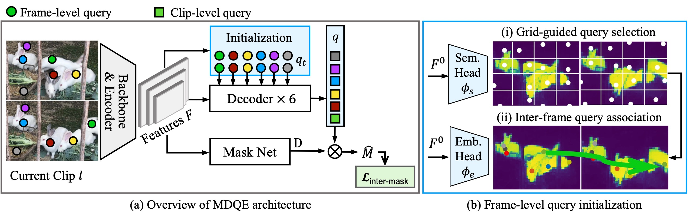
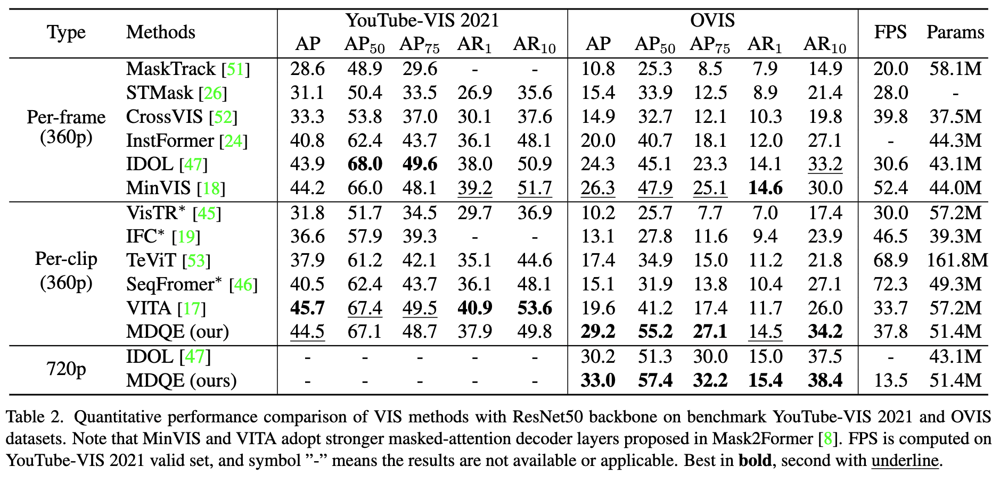

# MDQE: Mining Discriminative Query Embeddings to Segment Occluded Instances on Challenging Videos

[Minghan LI](https://scholar.google.com/citations?user=LhdBgMAAAAAJ), [Shuai LI](https://scholar.google.com/citations?user=Bd73ldQAAAAJ&hl=zh-TW), [Wangmeng XAING](https://scholar.google.com.hk/citations?user=LFNwNF4AAAAJ&hl=en), [Lei ZHANG](https://www4.comp.polyu.edu.hk/~cslzhang/)

[[`arXiv`]()] 

<div align="center">
  
</div><br/>

<div align="center">
  
</div><br/>

## Updates
* **`March 28, 2023`:** Code and paper are now available! 

## Installation

See [installation instructions](INSTALL.md).

## Getting Started

We provide a script `train_net.py`, that is made to train all the configs provided in MDQE.

Before training: To train a model with "train_net.py" on VIS, first
setup the corresponding datasets following
[Preparing Datasets for MDQE](./datasets/README.md).

Then download pretrained weights in the Model Zoo into the path 'pretrained/coco/*.pth', and run:
```
python train_net.py --num-gpus 8 \
  --config-file configs/R50_ovis_360.yaml 
```

To evaluate a model's performance, use
```
python train_net.py \
  --config-file configs/R50_ovis_360.yaml \
  --eval-only \
  MODEL.WEIGHTS /path/to/checkpoint_file
```

## <a name="ModelZoo"></a>Model Zoo

### Pretrained weights on COCO 
| Name |                                                               R50                                                               |                                                                  Swin-L                                                                  |
|:----:|:-------------------------------------------------------------------------------------------------------------------------------:|:----------------------------------------------------------------------------------------------------------------------------------------:|
| MDQE | [model](https://drive.google.com/file/d/1lQzh-7U3lelZWWzhPN9H5B6nF7_Jl9uQ/view?usp=sharing), [config](./configs/R50_coco.yaml)  |     [model](https://drive.google.com/file/d/1Dqf2xZqfX0CGOufURukuHTkX168dHXR7/view?usp=sharing), [config](./configs/swinl_coco.yaml)     |

### OVIS
| Name | Backbone |  Frames  |                                             AP                                             |                                                             Download                                                             |
|:----:|:--------:|:--------:|:------------------------------------------------------------------------------------------:|:--------------------------------------------------------------------------------------------------------------------------------:|
| MDQE |   R50    | f4+360p  |                                          [29.2]()                                          |                                         [model](), [config](./configs/R50_ovis_360.yaml)                                         |
| MDQE |   R50    | f4+7260p |                                          [33.0]()                                          |                                         [model](), [config](./configs/R50_ovis_720.yaml)                                         |
| MDQE |  Swin-L  | f2+480p  | [41.0](https://drive.google.com/file/d/1reZvXhvU-U99WUZydfEHDtnxqgTb6V8w/view?usp=sharing) | [model](https://drive.google.com/file/d/1IepHYepNZUhXRJSM1DVgDwWd9MyF7a7x/view?usp=sharing), [config](./configs/swinl_ovis.yaml) |
| MDQE |  Swin-L  | f2+640p  | [42.6](https://drive.google.com/file/d/1VExkn98fsWKyOgDEIc8vorrxe0nQaGI9/view?usp=sharing) | [model](https://drive.google.com/file/d/1IepHYepNZUhXRJSM1DVgDwWd9MyF7a7x/view?usp=sharing), [config](./configs/swinl_ovis.yaml) |

### YouTubeVIS-2021 
| Name | Backbone | Frames  |    AP    |                     Download                      |
|:----:|:--------:|:-------:|:--------:|:-------------------------------------------------:|
| MDQE |   R50    | f4+360p | [44.5]() |  [model](), [config](./configs/R50_ytvis21.yaml)  |
| MDQE |  Swin-L  | f3+360p | [56.2]() | [model](), [config](./configs/swinl_ytvis21.yaml) |


### YouTubeVIS-2019
| Name | Backbone | Frames  |    AP    |                     Download                      |
|:----:|:--------:|:-------:|:--------:|:-------------------------------------------------:| 
| MDQE |   R50    | f4+360p | [47.3]() |  [model](), [config](./configs/R50_ytvis19.yaml)  |
| MDQE |  Swin-L  | f3+360p | [63.0]() | [model](), [config](./configs/swinl_ytvis19.yaml) |

## License
The majority of MDQE is licensed under the [Apache-2.0 License](LICENSE).
However, portions of the project are available under separate license terms: Detectron2([Apache-2.0 License](https://github.com/facebookresearch/detectron2/blob/main/LICENSE)), IFC([Apache-2.0 License](https://github.com/sukjunhwang/IFC/blob/master/LICENSE)), VITA([Apache-2.0 License](https://github.com/sukjunhwang/VITA)), and Deformable-DETR([Apache-2.0 License](https://github.com/fundamentalvision/Deformable-DETR/blob/main/LICENSE)).

## <a name="CitingMDQE"></a>Citing MDQE

If you use MDQE in your research or wish to refer to the baseline results published in the Model Zoo, please use the following BibTeX entry.

```BibTeX
@inproceedings{li2022mdqe,
  title={MDQE: Mining Discriminative Query Embeddings to Segment Occluded Instances on Challenging Videos},
  author={Minghan Li, Shuai Li, Wangmeng Xiang, and Zhang Lei},
  journal={.},
  year={2023}
}
```

## Acknowledgement

Our code is largely based on [Detectron2](https://github.com/facebookresearch/detectron2), [IFC](https://github.com/sukjunhwang/IFC), [Deformable DETR](https://github.com/fundamentalvision/Deformable-DETR) and [VITA](https://github.com/sukjunhwang/VITA). We are truly grateful for their excellent work.
